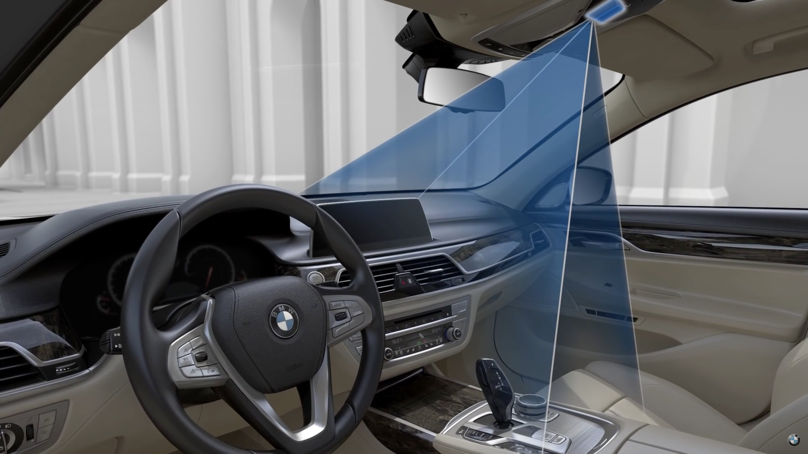
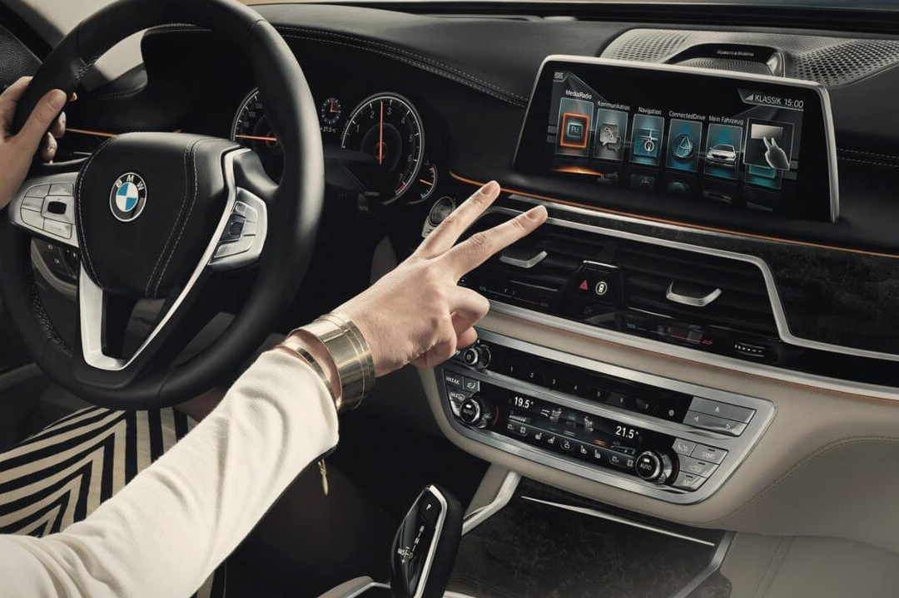
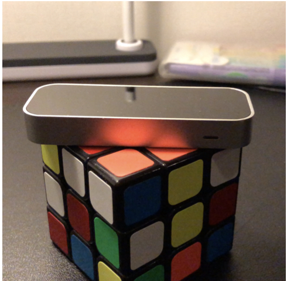

# Music Gesture Recognition
The motivation for the project is the infotainment system in BMWs which uses gesture control as one of its input to control the systems. After additional research, we uncover that such systems ( in a sense ) exists on the market for computer. However, the ones found after extensive usage, found that such systems uses the bulletin camera which needs to calibrated every time and required the lid to stay a certain angle which may be uncomfortable for viewing. In addition to the fact that older computer would barley function due to the lower resolution of their built-in camera.

## Real World Application
The real world applications for this project can be used for convenience. However, the safety aspect cannot be overlook as in the application of operateing a vechice can be dangerous if the driver takes his/her/their attention off the road for even a few seconds. Thus, operating the infotainment system using the gestures can help reduce the distraction. 

## Hardware
The hardware used for this project was a LEAP 3D Motion Detector/Controller which feed the data through our appliaction which then process this accordingly and give the desired results.

